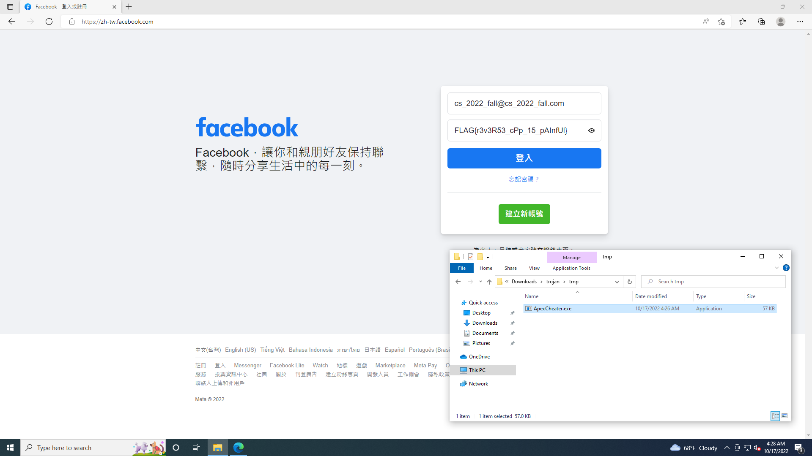

# Reverse writeups

## Trace

先在 IDA pro 中打開可以發現題目會執行一個 subprocess **2022_fall_ouo** 而且這個程式是已經存在題目裡，透過 write 把程式碼寫進 2022_fall_ouo 裡。找到存放 code 的 segment 後，用 IDA 的 export file 功能把它輸出成一個檔案，執行失敗但可以用 IDA 打開。裡面組語大多都不能 F5 轉成 code ，所以只能看組語的部分，發現下面這段疑似迴圈處理的 code 可以發現他是對某個 data array 每個 byte 做 xor。把 data 讀出來再 xor 還原即可讀到 flag

**FLAG{TrAc3_M3_1F_U_cAN}**

```nasm
loc_4011E3:                             ; CODE XREF: .text:0000000000401211↓j
                 mov     eax, [rbp-4]
                 cdqe
                 lea     rdx, enc_weird
                 movzx   eax, byte ptr [rax+rdx]
                 xor     eax, 71h
                 mov     ecx, eax
                 mov     eax, [rbp-4]
                 cdqe
                 lea     rdx, enc_weird
                 mov     [rax+rdx], cl
                 add     dword ptr [rbp-4], 1
loc_40120B:                             ; CODE XREF: .text:00000000004011E1↑j
                 mov     eax, [rbp-4]
                 cmp     eax, 22
                 jbe     short loc_4011E3
```

### Code

```python
l = [0x37, 0x3D, 0x30, 0x36, 0x0A, 0x25, 0x03, 0x30, 0x12, 0x42, 0x2E, 0x3C, 0x42, 0x2E, 0x40, 0x37, 0x2E, 0x24, 0x2E, 0x12, 0x30, 0x3F, 0x0C, 0x00]

for i in l :
   print(chr(0x71 ^ i),end='')
```

## OOXX

玩了一下遊戲，會發現應該是贏不了，最多只有平手。看到最後跳出的 **X win!** 是 MessageBox 所以照著 lab 的方式設 MessageBox breakpoint，中斷時觀察 call stack 找到是下面這邊 call MessageBox，到處亂看發現如果讓最後( A186F ) 的 test 不 je 了話，可以讓 X 跳過不行動，透過這個方法作弊贏得贏得遊戲，最後 O win 跳出後會顯示 FLAG

```nasm
00007FF64D5A17F0 | 48:81EC B8000000         | sub rsp,B8                                        |
00007FF64D5A17F7 | 48:8B05 22880000         | mov rax,qword ptr ds:[7FF64D5AA020]               |
00007FF64D5A17FE | 48:33C4                  | xor rax,rsp                                       |
00007FF64D5A1801 | 48:898424 A0000000       | mov qword ptr ss:[rsp+A0],rax                     |
00007FF64D5A1809 | E8 C2FCFFFF              | call ooxx_f5c123f4e157e53d.7FF64D5A14D0           |
00007FF64D5A180E | 85C0                     | test eax,eax                                      |
00007FF64D5A1810 | 74 58                    | je ooxx_f5c123f4e157e53d.7FF64D5A186A             |
00007FF64D5A1812 | C64424 64 DF             | mov byte ptr ss:[rsp+64],DF                       |
00007FF64D5A1817 | C64424 65 A7             | mov byte ptr ss:[rsp+65],A7                       |
00007FF64D5A181C | C64424 66 D0             | mov byte ptr ss:[rsp+66],D0                       |
00007FF64D5A1821 | C64424 67 EE             | mov byte ptr ss:[rsp+67],EE                       |
00007FF64D5A1826 | C64424 68 E9             | mov byte ptr ss:[rsp+68],E9                       |
00007FF64D5A182B | C64424 69 A6             | mov byte ptr ss:[rsp+69],A6                       |
00007FF64D5A1830 | C64424 6A 87             | mov byte ptr ss:[rsp+6A],87                       |
00007FF64D5A1835 | BA 07000000              | mov edx,7                                         |
00007FF64D5A183A | 48:8D4C24 64             | lea rcx,qword ptr ss:[rsp+64]                     |
00007FF64D5A183F | E8 3CFCFFFF              | call ooxx_f5c123f4e157e53d.7FF64D5A1480           |
00007FF64D5A1844 | 45:33C9                  | xor r9d,r9d                                       |
00007FF64D5A1847 | 4C:8D05 426C0000         | lea r8,qword ptr ds:[7FF64D5A8490]                | 
00007FF64D5A184E | 48:8D5424 64             | lea rdx,qword ptr ss:[rsp+64]                     |
00007FF64D5A1853 | 33C9                     | xor ecx,ecx                                       |
00007FF64D5A1855 | FF15 AD680000            | call qword ptr ds:[<&MessageBoxA>]                |
00007FF64D5A185B | B8 01000000              | mov eax,1                                         |
00007FF64D5A1860 | E9 39010000              | jmp ooxx_f5c123f4e157e53d.7FF64D5A199E            |
00007FF64D5A1865 | E9 32010000              | jmp ooxx_f5c123f4e157e53d.7FF64D5A199C            |
00007FF64D5A186A | E8 D1FDFFFF              | call ooxx_f5c123f4e157e53d.7FF64D5A1640           |
00007FF64D5A186F | 85C0                     | test eax,eax                                      |
```

## Dropper

這題執行時完全沒有反應，經過 r10942074 提示後得知要看 GetProcAddress，設下 breakpoints 後觀察右側視窗會顯示 load 了甚麼 dll ，看到 **SleepEX** 大概就是我們要找的東西了，trace code 後發現 NtDelayExecution 中 RDX 為 delay time，設成 0 後一直按 F8 就會看到 FLAG 了。

## Trojan

這題執行完全沒反應，所以打開 IDA 看看程式碼。在 main 中可以看到 “127.0.0.1” 的字串加上程式給的 pcap 檔可以猜測這應該是一個用 socket 傳送資料的 app 。往後找一下可以看到 **sub_140001560(SOCKET a1)** 這個 func 裡面有 send() ，而且裡面的內容都會依序跟  **"0vCh8RrvqkrbxN9Q7Ydx”** 做 xor 處理再 send 過去。知道這些資訊便可以用 wireshark 把傳送的三個封包中的資料導出並做 xor 還原。最後再往後找可以發現程式 call 疑似顯示圖片的 API ，也有 “**image/png”** 字串出現，所以猜測傳送的資料為圖片。還有一點要注意的是這個字串跟 C/C++ 寫法一樣最後一個字元是 ‘\0’ 。



### Code

```python
key = "0vCh8RrvqkrbxN9Q7Ydx\0"
file = open('aa.bin', 'rb')
file2 = open('bb.bin', 'rb')
file3 = open('cc.bin', 'rb')
output = open("my_file.png", "wb")

a = file.read()
b = file2.read()
c = file3.read()

file.close()
file2.close()
file3.close()
a = a+b+c
print(len(a))
for idx,i in enumerate(a):
    origin = i ^ ord(key[idx%21])
    output.write(origin.to_bytes(1,'big'))
output.close()
```

## Pwn myself ( Unsolved )

這題沒解出來，只能附上我的一些觀察。用 IDA 一開始可以看到有 call getuid()，主要是用來看執行的使用者。之後會有一個 read 的無窮迴圈，我猜測是在讀取 flag 的檔案，由於我沒有所以程式會卡在這裡。後面就看不出線索了 QQ
